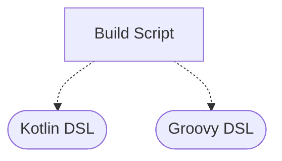
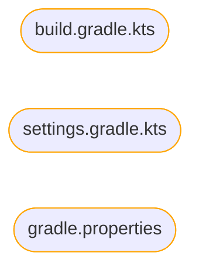

# gradle-learning-playground
Using the Gradle 🐘 as a powerful instrument for your builds requires a little bit of practice 🏋

# Lecture

# What is Gradle?

## Software Automation Is Key

- Process of automating software creation and release
- Typical examples:
    - Compiling source code
    - Running tests
    - Building binary artifacts

## How Does Gradle Fit In?

- Gradle is a general-purpose build automation tool
- Flexible yet powerful for different use cases
    - Building Java applications
    - Building Android applications
    - Automating Go or Python projects
    - Generating documentation
    - and a lot of other …

## Characteristics and Features

- Runs on the Java virtual machine
- Build logic defined as instructions in a script
- Plugins can provide predefined functionality
- Tool can be executed fro the terminal and IDE, or on CI server

# Installing Gradle

## Install types

- Requires JDK pre-installed
- Can be installed as a standalone application in system
    - manually from site [https://gradle.org/install/](https://gradle.org/install/)
    - from package manager of your system (`brew`, `apt-get` , etc)
- Using Gradle Wrapper
- From an IDE like Intellij IDEA

## Intellij IDEA demo

- create empty Gradle project

# Hello World

## Basic Gradle Terminology

- Project: models a software component
- Build script: contains automation instructions for a project
- Task: defines executable automation instructions

## Intellij IDEA demo

- open `gradle-learning-playground` project
- go to `theory/hello-world` module
- execute task from terminal
- execute task from IDEA

# Gradle’s domain-specific language

## Expressing Build Logic

- Gradle defines a domain-specific language (DSL)
- Can mix in imperative logic
- But more focused on declarative approach

## Available options



## Mapping of API to Domain Object

```kotlin
tasks.register("helloWorld") {
    doLast {
        println("Hello World")
    }
}
```


## Comparing Groovy and Kotlin DSL

Kotlin DSL

```kotlin
tasks.create("helloWorld") {
    doLast {
        println("Hello World")
    }
}
```

Groovy DSL

```groovy
task helloWorld {
    doLast {
        println "Hello World"
    }
}
```

- 🤔 difference `tasks.register(...)` vs `tasks.create(...)`

# Using the Gradle Wrapper

## Working with Multiple Versions

- Gradle API can include breaking changes in between major versions
- Maintaining multiple Gradle installations on a developer machine is not convenient

## The Gradle Wrapper

- Gradle Wrapper is a set of files checked into Git alongside source code
- Standardizes compatible Gradle version for a project
- Automatically downloads the Gradle distribution with defined version

## Intellij IDEA demo

- Show Gradle Wrapper distribution location
- Show `wrapper` task configuration

## Benefits

- Developers do not need to install the Gradle runtime
- Developers can check out project source code and build right away
- Wrapper works the same way on continuous integration servers

# Build files and conventions

## Build File in Single Project Build

```mermaid
flowchart TD;
		build.gradle([build.gradle.kts]) -.- src([src])
		style build.gradle stroke: orange
		style src fill: #417DB7, 
```

**Characteristics**

- Placed in root directory of project hierarchy
- Contains all build logic
- Can become hard to maintain

## Build Scripts in Multi-Module Build

```mermaid
flowchart LR;
		build.gradle([build.gradle.kts]) --- module1([module1])
		build.gradle([build.gradle.kts]) --- module2([module2])
		module1 ~~~ build.gradle1
		module2 ~~~ build.gradle2
		build.gradle1([build.gradle.kts]) -.- src1([src])
		build.gradle2([build.gradle.kts]) -.- src2([src])

		style build.gradle stroke: orange
		style module1 fill: #0e2469, stroke: #0e2469
		style module2 fill: #0e2469, stroke: #0e2469
		style build.gradle1 stroke: orange
		style src1 fill: #417DB7
		style build.gradle2 stroke: orange
		style src2 fill: #417DB7 
```



## Settings File in a Build


**Characteristics**

- Placed in root directory of project hierarchy
- Declares participating projects
- Can contain common build configurations and settings

## Gradle Properties File



**Characteristics**

- Placed in root directory of project hierarchy or Gradle user home directory
- Pre configures runtime behaviour

## Intellij IDEA demo with properties

[Configuring the Build Environment](https://docs.gradle.org/current/userguide/build_environment.html)

# Defining and configuring a task

## Purpose of a Task

- Defines executable unit of work
- Actions contain logic to be executed during runtime
- General categorisation:
    - ad hoc tasks
    - tasks explicitly declaring a type

## Ad Hoc Task

```mermaid
flowchart BT;
		DefaultTask([Default Task])
		AdHocTask([Ad Hoc Task]) -. extends .-> DefaultTask
		style DefaultTask stroke: orange
		style AdHocTask fill: #417DB7, 
```

**Characteristics**

- Implements one-off, simple action code by defining **`doFirst`** or **`doLast`**
- Automatically extend **`DefaultTask`** without having to declare it

## Example: Ad Hoc Task

```kotlin
tasks.register("helloWorld") { // No explicit type
    doLast {
        println("Hello World") // Action definition
    }
}
```

## Task Declaring a Type

```mermaid
flowchart BT;
		CopyTask([Copy])
		TypedTask([Typed Task]) -. extends .-> CopyTask
		style CopyTask stroke: orange
		style TypedTask fill: #417DB7, 
```

**Characteristics**

- Explicitly declares type (for example `Copy`)
- Does not necessarily need to define actions as they are already provided by type
- Can be configured for specific needs

## Example: Typed Task

```kotlin
tasks.register<Copy>("copyFiles") { // Explicit type as generic
    group = "custom-copy"
    description = "Copies files from one directory to another"

    from("sourceFiles") // Method provided by Copy task API
    into("destinationFiles") // Method provided by Copy task API
}
```

## Intellij IDEA demo → `typed-task`

- copy task example and run
- zip task example and run

# The directed acyclic graph (DAG)

## Task Execution Order


- Ensures that B and C is executed before A
- Does not explicitly define A if B or C is executed first
- Execution is not deterministic before runtime

## Task Execution Order Control


- Order of task execution can be specified by:
    - dependsOn
    - mustRunAfter
    - shouldRunAfter
- More at [https://docs.gradle.org/current/dsl/org.gradle.api.Task.html#org.gradle.api.Task.dependencies](https://docs.gradle.org/current/dsl/org.gradle.api.Task.html#org.gradle.api.Task.dependencies)

## Directed Acyclic Graph (DAG)


- Task is represented as node
- Task dependency is represented as graph edge

## Circular Dependencies


- Dependency cycles cannot be formed
- Gradle will fail build if detected

## Intellij IDEA example → `circular-dependency-tasks`

# Build lifecycle phases

## Build Execution under the Hood

- Evaluates instructions in build scripts
- Creates and configures tasks
- Executes tasks in correct order

## Lifecycle Phases


Init - evaluates settings file and sets up build

Config - evaluates build scripts and runs configuration logic

Exec - executes task actions in correct order

## Configuration Code

```kotlin
// configuration code

tasks.register("helloWorld") {
    // configuration code
    
    doFirst {}
    doLast {}
}
```

- Always outside of `doFirst` and `doLast` actions
- Executed during configuration phase

## Execution Code

```kotlin
tasks.register("helloWorld") {
    doFirst {
        // execution code
    }
    doLast {
        // execution code
    }
}
```

- Always inside of `doFirst` and `doLast` actions
- Executed during execution phase

# Applying reusable functionality with plugins

## Goal of Plugins

- Avoid repetitive code
- Make build logic more maintainable
- Provide reusable functionality across projects
- There are two types:
    - Script plugins
    - Binary plugins

## Script Plugins


## Binary Plugins


## Intellij IDEA Examples

- Simple Zip script plugin
- Binary plugins example in `plugins { ... }` block

# Project dependencies

## Usage of Dependencies

- Why we need them?
- Application vs Testing dependencies, and others
- Dependency notation
    - `group:name:version`
    - What is SNAPSHOT version?
    - Semantic versioning → [https://semver.org/](https://semver.org/)

## Bill of Materials (BOM)

- Transitive dependencies PROBLEM !
- Duplicate/Different versions problem
- BOM as dependencies versions management approach

## Intellij IDEA Examples

- usage of dependencies example
- BOM usage example

# Project Configuration

- `allprojects { ... }` configuration
- `subprojects { ... }` configuration
- Intellij IDEA examples

# Referencing the documentation

[Gradle User Manual](https://docs.gradle.org/current/userguide/userguide.html)

# Home Tasks

# Domain object runtime representation (after Applying reusable functionality with plugins)

- !!! skip for current moment
